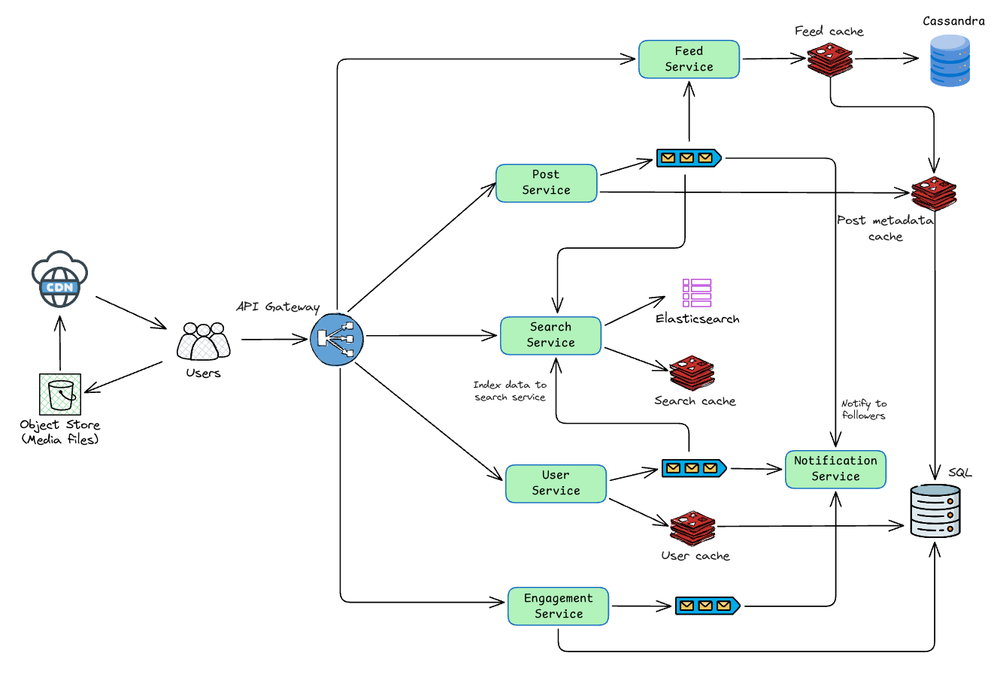

## 1. Clarify Requirements

### 1.1 Functional Requirements

- Upload photos and videos with captions
- Follow/unfollow users; receive notifications on follow
- Like, comment, share posts; receive notifications on engagement
- Search users and hashtags
- Generate a news feed sorted by relevancy and freshness

### 1.2 Non-Functional Requirements

- 99.99% availability
- Eventual consistency (acceptable for feed, likes, comments)
- Durable: 3x replication minimum, geo-redundancy for DR
- 1 billion registered users, 500 million DAU
- 100 million uploads per day
- Feed load time < 100 ms

**Out of scope:** Stories, reels, DMs, live streaming, ads.

## 2. Capacity Estimation

| Metric                | Value                                |
|-----------------------|--------------------------------------|
| Registered users      | 1 billion                            |
| DAU                   | 500 million                          |
| Uploads/day           | 100 million (80% photos, 20% videos) |
| Feed scrolls/user/day | ~100 posts                           |
| Feed requests/day     | 50 billion                           |

### 2.1 Throughput

```
Writes (uploads + metadata):
  100M uploads/day
  Each upload generates ~2 DB writes (post + media)
  Write QPS = 200M / 86,400 ≈ 2,300 QPS
  Peak (3x)                 ≈ 7,000 QPS

Reads (feed):
  50B feed item loads/day
  Read QPS = 50B / 86,400 ≈ 580,000 QPS
  ~80% cache hit → DB reads ≈ 116,000 QPS
```

### 2.2 Storage

```
Photos: 80M/day * 1 MB   = 80 TB/day
Videos: 20M/day * 10 MB  = 200 TB/day
Total media               = 280 TB/day (~102 PB/year)

Post metadata: 100M/day * 500 B ≈ 50 GB/day (~18 TB/year)
```

Hot cache: ~1 billion recent/popular posts * 2 KB each ≈ 2 TB (Redis).

### 2.3 Bandwidth

Media uploads go directly to S3 via pre-signed URLs; media reads are served from CDN. API servers handle metadata only.

```
S3 ingress (uploads)  = 280 TB / 86,400 ≈ 3.24 GB/s (~26 Gbps)
CDN egress (media)    = 500M users * 50 media views * avg 500 KB / 86,400
                      ≈ 145 GB/s (~1.16 Tbps)
API server bandwidth  = metadata only (negligible)
```

## 3. Core APIs

### 3.1 Create Post

`POST /posts` (multipart/form-data)

| Field      | Type   | Required | Description                   |
|------------|--------|----------|-------------------------------|
| `caption`  | string | No       | Post caption text             |
| `media`    | file[] | Yes      | One or more photo/video files |
| `location` | string | No       | Location tag                  |

**Response** `201 Created`

```json
{
  "post_id": 4368,
  "status": "processing"
}
```

Media upload is a two-phase process: the client receives pre-signed S3 URLs, uploads files directly, then confirms completion. Details in section 6.1.

### 3.2 Get Feed

`GET /feeds?cursor={post_id}&limit=20`

**Response** `200 OK`

```json
{
  "posts": [
    {
      "post_id": 3248,
      "user_id": 8764487,
      "username": "dhanush-p",
      "caption": "Travelling",
      "media": ["https://cdn.example.com/photo4757.jpg"],
      "likes_count": 147,
      "comments_count": 2,
      "created_at": "2026-05-18T10:15:00Z"
    }
  ],
  "next_cursor": "3247",
  "has_more": true
}
```

Cursor-based pagination using `post_id`. Offset pagination is unusable at 50B feed items.

### 3.3 Get User Profile

`GET /users/{username}`

**Response** `200 OK`

```json
{
  "user_id": 32475,
  "username": "dharun-kumar",
  "display_name": "Dharun Kumar",
  "profile_pic": "https://cdn.example.com/dharun-kumar.jpg",
  "followers_count": 350,
  "following_count": 400
}
```

### 3.4 Follow User

`POST /users/{user_id}/follow`

**Response** `200 OK`

### 3.5 Get Post by ID

`GET /posts/{post_id}`

**Response** `200 OK`

```json
{
  "post_id": 4368,
  "user_id": 32475,
  "username": "dharun-kumar",
  "caption": "Nothing excites",
  "media": [
    "https://cdn.example.com/photo1.jpg",
    "https://cdn.example.com/video1.mp4"
  ],
  "likes_count": 118,
  "comments_count": 8,
  "created_at": "2026-05-18T12:30:00Z"
}
```

### 3.6 Engagement

`POST /posts/{post_id}/like` -- Toggle like on a post

`POST /posts/{post_id}/comment`

```json
{ "content": "Great pic!" }
```

`GET /posts/{post_id}/comments?cursor={comment_id}&limit=20`

### 3.7 Search

`GET /search/users?q=dharun`

```json
[
  {
    "user_id": 32475,
    "username": "dharun-kumar",
    "display_name": "Dharun Kumar",
    "profile_pic": "https://cdn.example.com/dharun-kumar.jpg"
  }
]
```

## 4. High-Level Architecture

### 4.1 Components

**Client** -- Browsers and mobile apps. Handles media playback, UI rendering. Communicates with backend via API Gateway.

**API Gateway** -- Authentication, authorization, rate limiting, request routing. Acts as the single entry point for all client requests.

**Post Service** -- Handles uploads. Generates pre-signed S3 URLs, stores post metadata in the database, publishes a Kafka event to notify the feed service.

**Feed Service** -- Precomputes and stores user feeds in cache (Redis) for fast retrieval. Falls back to database on cache miss. Consumes Kafka events to update feeds on new posts.

**Engagement Service** -- Manages likes, comments, and shares. Writes engagement data asynchronously via Kafka for high throughput.

**User Service** -- Manages authentication, profiles, and follow/unfollow relationships.

**Search Service** -- Indexes users, posts, and hashtags in Elasticsearch. Supports autocomplete and full-text search.

**Notification Service** -- Sends push notifications (APNs/FCM) for follows, likes, and comments. Consumes Kafka events asynchronously.

**Kafka** -- Decouples services. Notifies feed service of new posts, triggers engagement updates, drives search indexing, and sends notifications.

**S3 + CDN** -- Media stored in S3. CDN (CloudFront/Cloudflare) serves cached media from edge locations globally.

## 5. Database Design

Instagram stores both structured data (users, posts, relationships) and unstructured data (media, feeds, search indexes).

| Data                                   | Database          | Reason                                                     |
|----------------------------------------|-------------------|------------------------------------------------------------|
| Users, posts, likes, comments, follows | PostgreSQL        | Relational, ACID, complex queries, read replicas           |
| Feeds                                  | Cassandra + Redis | Write-heavy fanout, time-series ordering, fast cache reads |
| Search                                 | Elasticsearch     | Full-text search, prefix matching, ranking                 |
| Media                                  | S3 + CDN          | Binary blobs, pre-signed uploads, edge delivery            |

PostgreSQL is used with application-level sharding and read replicas. Sharding strategy: `user_id` for user data, `post_id` for posts and engagement.

### 5.1 Relational Schema (PostgreSQL)

#### Users Table

| Column            | Type         | Constraints               | Description                 |
|-------------------|--------------|---------------------------|-----------------------------|
| `user_id`         | BIGINT       | PK                        | Unique user identifier      |
| `username`        | VARCHAR(30)  | UNIQUE, NOT NULL, INDEXED | Login handle                |
| `display_name`    | VARCHAR(100) | NULLABLE                  | Display name                |
| `bio`             | VARCHAR(500) | NULLABLE                  | Profile bio                 |
| `email`           | VARCHAR(255) | UNIQUE, NOT NULL          | Email address               |
| `profile_pic_url` | VARCHAR(512) | NULLABLE                  | CDN URL for profile picture |
| `password_hash`   | VARCHAR(255) | NOT NULL                  | Bcrypt hash                 |
| `created_at`      | TIMESTAMP    | NOT NULL, DEFAULT NOW()   | Account creation time       |

#### Posts Table

| Column           | Type          | Constraints                      | Description                                 |
|------------------|---------------|----------------------------------|---------------------------------------------|
| `post_id`        | BIGINT        | PK                               | Unique post identifier                      |
| `user_id`        | BIGINT        | FK -> users, INDEXED             | Post author                                 |
| `caption`        | VARCHAR(2200) | NULLABLE                         | Post caption (Instagram limit: 2,200 chars) |
| `location`       | VARCHAR(255)  | NULLABLE                         | Location tag                                |
| `likes_count`    | BIGINT        | NOT NULL, DEFAULT 0              | Denormalized like count                     |
| `comments_count` | BIGINT        | NOT NULL, DEFAULT 0              | Denormalized comment count                  |
| `created_at`     | TIMESTAMP     | NOT NULL, DEFAULT NOW(), INDEXED | Post creation time                          |

#### Media Table

| Column       | Type         | Constraints          | Description                     |
|--------------|--------------|----------------------|---------------------------------|
| `media_id`   | BIGINT       | PK                   | Unique media identifier         |
| `post_id`    | BIGINT       | FK -> posts, INDEXED | Parent post                     |
| `media_type` | ENUM         | NOT NULL             | `photo` or `video`              |
| `media_url`  | VARCHAR(512) | NOT NULL             | CDN URL for the media file      |
| `sort_order` | INT          | NOT NULL, DEFAULT 0  | Order within a multi-media post |

#### Followers Table

| Column             | Type      | Constraints                          | Description                               |
|--------------------|-----------|--------------------------------------|-------------------------------------------|
| `follower_id`      | BIGINT    | PK (composite), FK -> users, INDEXED | The user who follows                      |
| `followee_id`      | BIGINT    | PK (composite), FK -> users, INDEXED | The user being followed                   |
| `engagement_score` | DOUBLE    | NOT NULL, DEFAULT 0.0                | Interaction weight; used for feed ranking |
| `created_at`       | TIMESTAMP | NOT NULL, DEFAULT NOW()              | Follow time                               |

#### Likes Table

| Column       | Type      | Constraints                 | Description    |
|--------------|-----------|-----------------------------|----------------|
| `post_id`    | BIGINT    | PK (composite), FK -> posts | Liked post     |
| `user_id`    | BIGINT    | PK (composite), FK -> users | User who liked |
| `created_at` | TIMESTAMP | NOT NULL, DEFAULT NOW()     | Like time      |

Composite PK on `(post_id, user_id)` enforces one like per user per post.

#### Comments Table

| Column       | Type      | Constraints             | Description               |
|--------------|-----------|-------------------------|---------------------------|
| `comment_id` | BIGINT    | PK                      | Unique comment identifier |
| `post_id`    | BIGINT    | FK -> posts, INDEXED    | Parent post               |
| `user_id`    | BIGINT    | FK -> users             | Comment author            |
| `content`    | TEXT      | NOT NULL                | Comment body              |
| `created_at` | TIMESTAMP | NOT NULL, DEFAULT NOW() | Comment time              |

### 5.2 Feed Store (Cassandra + Redis)

Precomputed feed table reduces generation latency. Each row is a feed entry for one user.

```json
{
  "user_id": 56789,
  "feed": [
    {"post_id": 43346, "user_id": 346, "media_url": "https://cdn.example.com/path1", "caption": "Travelling"},
    {"post_id": 34787, "user_id": 786, "media_url": "https://cdn.example.com/path2", "caption": "Vibing"}
  ]
}
```

- Updated asynchronously via Kafka when a user posts
- Cached in Redis for active users; Cassandra serves as durable fallback

### 5.3 Search Indexes (Elasticsearch)

User profiles and post metadata are indexed as documents for full-text search, prefix matching, and ranking by engagement/popularity.

Hashtags are stored in a separate index to support trending hashtag queries, each document containing the hashtag, post count, and last-used timestamp.

## 6. Deep Dive



### 6.1 Photo/Video Upload

1. User selects media files and enters caption/location. Client sends a request to the API Gateway.
2. API Gateway authenticates and routes to the Post Service.
3. Post Service generates pre-signed S3 URLs (one per file) and returns them to the client.
4. Client uploads files in parallel directly to S3 via pre-signed URLs.
5. On completion, client sends a confirmation to the Post Service with all media URLs.
6. Post Service writes post metadata to the Posts table and media entries to the Media table.
7. Post Service publishes a Kafka event notifying the Feed Service and Search Service.

Pre-signed URLs keep media bytes off app servers, reducing backend load and enabling faster parallel uploads.

### 6.2 News Feed Generation

#### Fan-out on write (push) -- followers < 1,000

For users with a manageable follower count, the feed is precomputed at write time.

1. User creates a post; Post Service publishes a Kafka event
2. Feed Service consumes the event and fetches the user's follower list
3. Post is inserted into each follower's precomputed feed in Redis
4. When followers open their feeds, posts are instantly available

Low read latency. Write cost is proportional to follower count.

#### Fan-out on read (pull) -- followers > 1,000

For celebrities, pushing to millions of feeds per post is impractical.

1. Celebrity posts are stored in a hot cache (not pushed to follower feeds)
2. When a user requests their feed, the Feed Service merges:
   - Regular posts from the user's precomputed Redis feed
   - Celebrity posts fetched on-demand from the hot cache
3. Merged feed is ranked by relevancy (engagement score) and freshness before serving

Avoids massive write amplification at the cost of slightly higher read latency.

### 6.3 Search

**Indexing:**
1. On new post/user creation, the service publishes a Kafka event
2. Search Service consumes the event and indexes the document in Elasticsearch

**Query flow:**
1. Client sends a search query; API Gateway routes to Search Service
2. Search Service checks Redis cache for recent/frequent queries
3. On cache miss, queries Elasticsearch (full-text search, prefix matching, engagement-based ranking)
4. Results are cached in Redis for future lookups

### 6.4 Engagement

Likes and comments are processed asynchronously to handle high throughput.

1. User sends a like/comment request to the Engagement Service
2. Engagement Service publishes a Kafka event
3. Consumer updates the database (inserts like/comment row, increments denormalized counters on the post)
4. Notification Service consumes the same event to send a push notification to the post author

## 7. Wrap Up

### 7.1 Key Decisions

| Decision          | Choice               | Why                                                                                   |
|-------------------|----------------------|---------------------------------------------------------------------------------------|
| Primary DB        | PostgreSQL (sharded) | Relational data, ACID, read replicas for 100:1 read-write ratio                       |
| Feed store        | Cassandra + Redis    | Write-heavy fanout, time-series, fast cache reads                                     |
| Search            | Elasticsearch        | Full-text search, prefix matching, ranking                                            |
| Media storage     | S3 + CDN             | Pre-signed uploads, edge delivery, 11-nines durability                                |
| Queue             | Kafka                | Decouples services, durable, ordered per partition                                    |
| Feed strategy     | Hybrid push/pull     | Push for normal users (fast reads), pull for celebrities (avoids write amplification) |
| Engagement writes | Async via Kafka      | High throughput without blocking the user request                                     |

### 7.2 Scalability

- Stateless microservices (feed, post, user, engagement) behind load balancers; scale independently
- Application-level sharding: `user_id` for user data, `post_id` for posts and engagement
- Kafka absorbs traffic bursts for feed fanout, engagement updates, search indexing, and notifications
- Redis cache for feeds and search results; 80% cache hit rate keeps DB load manageable
- CDN offloads all media egress bandwidth from app servers

### 7.3 Availability

- Database replication (3x) across availability zones; automatic failover
- Circuit breakers to gracefully degrade if a downstream service fails
- Multi-region deployment for disaster recovery

### 7.4 Durability

PostgreSQL and S3 are the sources of truth. All derived stores are rebuildable:

```
Post write
  → PostgreSQL (sync, durable)
  → Kafka event
    ├── Feed Service → Cassandra + Redis (follower feeds)
    ├── Cache invalidation → Redis
    └── Search Service → Elasticsearch
```

If any derived store is lost, it can be rebuilt by replaying from PostgreSQL + Kafka.

### 7.5 Monitoring

| Metric                            | Why It Matters                               |
|-----------------------------------|----------------------------------------------|
| Feed load latency (p50, p95, p99) | Core user experience                         |
| Upload success rate               | Detects S3/pre-signed URL issues             |
| Kafka consumer lag                | Indicates feed/engagement processing backlog |
| Cache hit rate                    | Drop means increased DB load                 |
| DB query latency per shard        | Detects hot shards                           |
| CDN cache hit rate                | Low rate means high origin load              |
