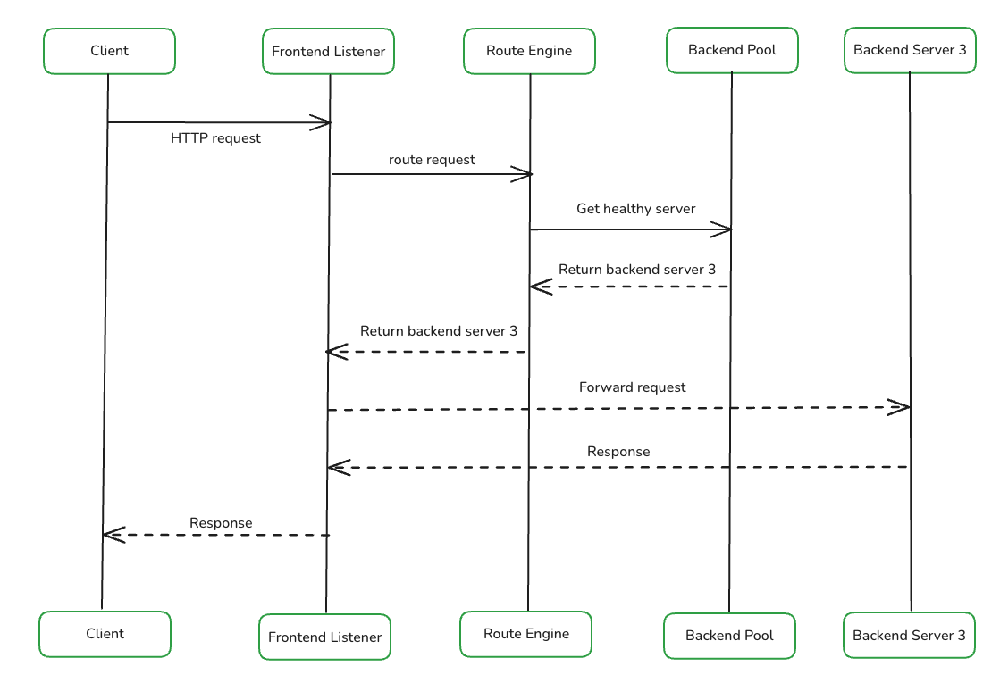

## 1. Clarify Requirements

### 1.1 Functional Requirements

- Distribute traffic across multiple backend servers
- Monitor backend servers and remove unhealthy ones from the pool
- Support sticky sessions (IP hash and cookie-based)
- SSL/TLS termination (offloading)
- Support both L4 (transport) and L7 (application) load balancing

### 1.2 Non-Functional Requirements

- 99.99% availability
- Low latency: < 1 ms added per hop
- Handle 1 million requests per second (RPS)
- Horizontally scalable

## 2. Capacity Estimation

### 2.1 Peak Requests

```
Base RPS             = 1,000,000
Peak RPS (3x)        = 3,000,000

Concurrent connections = RPS * avg request duration
                       = 1,000,000 * 0.5 s
                       = 500,000 connections
```

### 2.2 Bandwidth

```
Average request size  = ~10 KB (headers + payload)
Average response size = ~50 KB

Inbound bandwidth  = 1M * 10 KB  = 10 GB/s
Outbound bandwidth = 1M * 50 KB  = 50 GB/s
Total bandwidth    = 60 GB/s     = ~480 Gbps
```

### 2.3 Health Checks

```
Backend servers      = 1,000
Health check interval = 5 s

Checks per second = 1,000 / 5 = 200 checks/s  (negligible overhead)
```

### 2.4 Memory

Each active connection requires state tracking: source/destination IP and port, connection state, timestamps, protocol-specific data, and buffer space.

```
Memory per connection     = ~500 bytes
Concurrent connections    = 500,000

Total = 500,000 * 500 B  = 250 MB
```

## 3. Core APIs

### 3.1 Register Backend Server

`POST /backends`

**Request Body**

```json
{
  "address": "10.1.1.15",
  "port": 8080,
  "health_check_path": "/health",
  "weight": 2
}
```

| Field               | Type    | Required | Description                                            |
|---------------------|---------|----------|--------------------------------------------------------|
| `address`           | string  | Yes      | IP address or hostname of the backend server           |
| `port`              | integer | Yes      | Port the backend server listens on                     |
| `health_check_path` | string  | No       | HTTP path used for health probes (default: `/health`)  |
| `weight`            | integer | No       | Relative weight for weighted algorithms (default: `1`) |

**Response** `201 Created`

```json
{
  "backend_id": "backend-2r4y89",
  "status": "healthy"
}
```

### 3.2 Remove Backend Server

`DELETE /backends/{backend_id}`

Initiates graceful draining: the server stops receiving new connections but existing connections are allowed to complete before the server is removed from the pool.

**Response** `202 Accepted`

```json
{
  "backend_id": "backend-2r4y89",
  "status": "draining",
  "active_connections": 42
}
```

### 3.3 Get Backend Server Health

`GET /backends/{backend_id}/health`

**Response** `200 OK`

```json
{
  "backend_id": "backend-2r4y89",
  "status": "healthy",
  "total_requests": 170000,
  "failed_requests": 12,
  "response_time_ms": 11,
  "last_check": "2026-09-05T10:30:00Z",
  "active_connections": 537
}
```

| Field                | Type              | Description                                             |
|----------------------|-------------------|---------------------------------------------------------|
| `status`             | string            | `healthy`, `unhealthy`, or `draining`                   |
| `total_requests`     | integer           | Lifetime request count routed to this server            |
| `failed_requests`    | integer           | Lifetime failed request count                           |
| `response_time_ms`   | integer           | Average response time from the last health check window |
| `last_check`         | string (ISO 8601) | Timestamp of the most recent health probe               |
| `active_connections` | integer           | Current open connections to this server                 |

### 3.4 Configure LB Algorithm

`PUT /config/algorithm`

**Request Body**

```json
{
  "algorithm": "least_connections",
  "sticky_sessions": true,
  "sticky_sessions_ttl_seconds": 3600
}
```

| Field                         | Type     | Required | Description                                                                                                                    |
|-------------------------------|----------|----------|--------------------------------------------------------------------------------------------------------------------------------|
| `algorithm`                   | string   | Yes      | One of: `round_robin`, `weighted_round_robin`, `least_connections`, `weighted_least_connections`, `ip_hash`, `consistent_hash` |
| `sticky_sessions`             | boolean  | No       | Enable sticky sessions (default: `false`)                                                                                      |
| `sticky_sessions_ttl_seconds` | integer  | No       | Time-to-live for sticky session bindings (default: `3600`)                                                                     |

## 4. High-Level Architecture

The load balancer has three responsibilities: distribute traffic, monitor health, and maintain high availability.

### 4.1 Traffic Distribution

#### Frontend Listener

The frontend listener binds to one or more ports and:

- Accepts incoming TCP connections
- For L7, parses the HTTP request (headers, URL path, method) to enable content-based routing
- Hands the connection to the routing engine for backend selection

#### Routing Engine

The routing engine is the decision-making core. It maintains:

- A registry of available servers with metadata (IP, port, weight) and current state (healthy/unhealthy/draining)
- The configured LB algorithm
- Per-server connection counters (required for least-connections algorithms)

#### Connection Pool Manager

Maintains a pool of persistent, reusable TCP connections to each backend server. Instead of opening a new connection per request, the routing engine borrows a ready connection from the pool. This reduces latency and avoids TCP handshake overhead under high throughput.

#### Backend Pool

A backend pool is a logical group of servers that handle a specific type of traffic. The system can have multiple pools (e.g., one for API traffic, another for static assets). Each pool has its own algorithm configuration and health check settings.

#### Request Flow



1. Client sends an HTTP request to the load balancer's public IP
2. The frontend listener accepts the TCP connection, reads the request, and forwards it to the routing engine
3. The routing engine queries the backend pool, filters out unhealthy servers, and applies the configured algorithm to select a server
4. The routing engine borrows a connection from the connection pool manager (or opens a new one) and forwards the request to the selected backend
5. The backend processes the request and sends the response back through the load balancer to the client

### 4.2 Health Monitor

The health checker runs probes against every backend server at a configured interval.

**Failure detection:**
- A probe is sent every N seconds (default: 5s)
- A server is marked unhealthy only after **3 consecutive failures** (to tolerate transient network blips)
- The routing engine is notified immediately and stops sending new traffic to that server

**Recovery:**
- Once the server starts responding again, it must pass **3 consecutive checks** before being marked healthy
- This prevents flapping servers from receiving traffic prematurely

**Probe types:**

| Type   | Mechanism                                                                     | Use Case                                          |
|--------|-------------------------------------------------------------------------------|---------------------------------------------------|
| TCP    | Opens a TCP connection and closes it                                          | L4 LB; basic port-reachability check              |
| HTTP   | Sends a GET to a configured path (e.g., `/health`) and expects a 2xx response | L7 LB; verifies application readiness             |
| Custom | Runs a user-defined command or script                                         | App-specific checks (e.g., database connectivity) |

### 4.3 High Availability

A single load balancer is a single point of failure. Two common patterns address this.

#### Active-Passive

- Two LB nodes share a **Virtual IP (VIP)**. Only the primary handles traffic.
- The standby continuously monitors the primary via heartbeat.
- If the primary fails, the standby claims the VIP by broadcasting a **Gratuitous ARP** message. Failover completes within 1-3 seconds.
- Drawback: the standby is idle and underutilized during normal operation.

#### Active-Active

- Multiple LB nodes handle traffic simultaneously. Traffic is distributed to them via:

| Method          | Description                                                                     |
|-----------------|---------------------------------------------------------------------------------|
| DNS Round-Robin | DNS returns multiple IPs; the client picks one                                  |
| Upstream L4 LB  | A lightweight L4 LB distributes traffic across L7 LB nodes                      |
| Anycast         | All nodes advertise the same IP; the network routes to the nearest healthy node |

- With multiple LB nodes, IP-hash sticky sessions require shared state (an external store like Redis) or an additional LB layer. **Cookie-based sticky sessions** avoid this problem entirely since the routing hint is carried in the request itself.

## 5. Database Design

### 5.1 Database Schema

The load balancer's data-plane (forwarding packets) operates entirely in-memory because every nanosecond counts at millions of RPS. The schemas below describe the **control-plane** configuration store used by the management API.

In-memory runtime state:

| Data                                | Estimated Size |
|-------------------------------------|----------------|
| 500K concurrent connection entries  | ~250 MB        |
| 1,000 backend server health records | ~100 KB        |
| Per-server connection counters      | ~8 KB          |

#### Backend Servers Table

| Column         | Type          | Constraints                 | Description                             |
|----------------|---------------|-----------------------------|-----------------------------------------|
| `backend_id`   | VARCHAR(36)   | PK                          | Unique identifier (e.g., UUID)          |
| `pool_id`      | VARCHAR(36)   | FK -> backend_pools         | Pool this server belongs to             |
| `address`      | VARCHAR(255)  | NOT NULL                    | IP address or hostname                  |
| `port`         | INT           | NOT NULL                    | Listening port (1-65535)                |
| `weight`       | INT           | NOT NULL, DEFAULT 1         | Relative weight for weighted algorithms |
| `status`       | ENUM          | NOT NULL, DEFAULT 'healthy' | `healthy`, `unhealthy`, `draining`      |
| `created_at`   | TIMESTAMP     | NOT NULL                    | Record creation time                    |
| `updated_at`   | TIMESTAMP     | NOT NULL                    | Last modification time                  |

#### Backend Pools Table

| Column                    | Type         | Constraints                     | Description                                           |
|---------------------------|--------------|---------------------------------|-------------------------------------------------------|
| `pool_id`                 | VARCHAR(36)  | PK                              | Unique identifier                                     |
| `name`                    | VARCHAR(128) | NOT NULL, UNIQUE                | Human-readable pool name                              |
| `algorithm`               | ENUM         | NOT NULL, DEFAULT 'round_robin' | LB algorithm for this pool                            |
| `health_check_type`       | ENUM         | NOT NULL, DEFAULT 'http'        | `tcp`, `http`, or `custom`                            |
| `health_check_path`       | VARCHAR(255) | NULLABLE                        | HTTP path for health probes (used when type = `http`) |
| `health_check_interval_s` | INT          | NOT NULL, DEFAULT 5             | Seconds between health probes                         |
| `unhealthy_threshold`     | INT          | NOT NULL, DEFAULT 3             | Consecutive failures before marking unhealthy         |
| `healthy_threshold`       | INT          | NOT NULL, DEFAULT 3             | Consecutive successes before marking healthy          |
| `sticky_sessions`         | BOOLEAN      | NOT NULL, DEFAULT false         | Whether sticky sessions are enabled                   |
| `sticky_ttl_s`            | INT          | NOT NULL, DEFAULT 3600          | TTL for sticky session bindings (seconds)             |
| `created_at`              | TIMESTAMP    | NOT NULL                        | Record creation time                                  |
| `updated_at`              | TIMESTAMP    | NOT NULL                        | Last modification time                                |

### 6. Deep Dive

### 6.1 LB Algorithms

| Algorithm                  | Description                                                                                                                   | Best For                                          |
|----------------------------|-------------------------------------------------------------------------------------------------------------------------------|---------------------------------------------------|
| Round Robin                | Requests are distributed sequentially across servers                                                                          | Homogeneous servers with equal capacity           |
| Weighted Round Robin       | Same as round robin, but servers with higher weight receive proportionally more requests                                      | Heterogeneous servers with varying capacity       |
| Least Connections          | Routes to the server with the fewest active connections                                                                       | Long-lived connections (WebSockets, streaming)    |
| Weighted Least Connections | Least connections adjusted by server weight                                                                                   | Heterogeneous servers with long-lived connections |
| IP Hash                    | `hash(client_ip) % server_count` maps a client to a fixed server                                                              | Sticky sessions at L4 without external state      |
| Consistent Hashing         | Servers are placed on a hash ring; requests hash to the nearest server. Adding/removing a server only remaps ~1/N of requests | Minimizing disruption during scaling events       |

### 6.2 Sticky Sessions

Sticky sessions ensure subsequent requests from the same client are routed to the same backend server.

| Method             | How It Works                                                                                                                                                          | Pros                               | Cons                                                                       |
|--------------------|-----------------------------------------------------------------------------------------------------------------------------------------------------------------------|------------------------------------|----------------------------------------------------------------------------|
| **Source IP Hash** | `hash(client_ip) % server_count` maps the client to a fixed server                                                                                                    | No state to store; works at L4     | Breaks when clients share IPs (NAT/proxies); remaps on server count change |
| **Cookie-Based**   | On first request, LB picks a server and sets a cookie (e.g., `X-LB-Server=backend-3`). Subsequent requests include this cookie, and the LB reads it to route directly | Survives NAT; per-user granularity | Requires L7; adds a Set-Cookie header on first response                    |

Cookie-based is preferred in most production setups because it is unaffected by NAT and does not remap when the server count changes.


### 6.3 L4 vs L7 Load Balancing

| Aspect            | L4 (Transport)                                        | L7 (Application)                                            |
|-------------------|-------------------------------------------------------|-------------------------------------------------------------|
| Operates on       | IP addresses, TCP/UDP ports                           | HTTP headers, URL path, cookies, method                     |
| Routing decisions | Source/destination IP and port                        | Content-based: path, host header, query params              |
| SSL termination   | No (passes encrypted traffic through)                 | Yes (decrypts, inspects, re-encrypts or forwards plaintext) |
| Cookie handling   | Not possible                                          | Can set, read, and modify cookies                           |
| Performance       | Higher throughput, lower latency (no payload parsing) | Slightly higher latency due to HTTP parsing                 |
| Use case          | High-throughput TCP services, databases, gaming       | Web applications, APIs, microservices                       |

L4 and L7 are often used together: an L4 LB distributes traffic across multiple L7 LB nodes, which then make content-aware routing decisions.

### 6.4 SSL Termination

SSL/TLS termination at the load balancer provides three benefits:

1. **CPU offloading** -- TLS encryption/decryption is CPU-intensive. Terminating at the LB frees backend servers to spend CPU on application logic.
2. **Request visibility** -- To route based on URL path, headers, or cookies, the LB must read the HTTP request. This is impossible if traffic is encrypted end-to-end. SSL termination gives the LB visibility into request content.
3. **TLS session caching** -- The LB can cache TLS sessions so that reconnecting clients skip the full TLS handshake, reducing latency for repeat visitors.

Traffic between the LB and backends typically travels over a private network. If encryption is still required on this internal leg, the LB can re-encrypt using a lighter internal certificate (known as SSL bridging).

## 6.5 Monitoring and Observability

A production load balancer should expose metrics for alerting and capacity planning.

| Metric                      | Description                                   |
|-----------------------------|-----------------------------------------------|
| Request rate (RPS)          | Total requests per second across all backends |
| Error rate                  | Percentage of 4xx/5xx responses               |
| Latency (p50, p95, p99)     | Request latency distribution at the LB layer  |
| Active connections          | Current open connections per backend          |
| Backend health status       | Healthy/unhealthy/draining state per server   |
| Connection pool utilization | Borrowed vs. idle connections per backend     |
| Bandwidth in/out            | Bytes per second inbound and outbound         |

Logs should capture per-request metadata: client IP, selected backend, response status, and latency. These feed into dashboards and anomaly detection.
