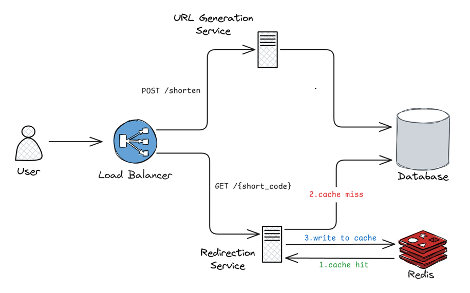

## 1. Clarify Requirements

### 1.1 Functional Requirements

- Generate a unique short URL for a given long URL
- Redirect to the original long URL when the short URL is accessed
- Allow custom short codes (aliases)
- Support link expiration with default or custom TTLs
- Track click counts per short URL

### 1.2 Non-Functional Requirements

- 99.99% availability
- Low latency: p99 < 50 ms for redirects
- Each long URL maps to a unique short URL
- Read-heavy workload (100:1 read-to-write ratio)
- Durable -- no data loss once a URL mapping is created

## 2. Capacity Estimation

### 2.1 Throughput

```
New links per day = 10 million

Writes (URL creation):
  Avg QPS  = 10,000,000 / 86,400 ≈ 115 QPS
  Peak (3x) = ~350 QPS

Reads (Redirects):
  100:1 ratio → 1 billion redirects/day
  Avg QPS  = 1,000,000,000 / 86,400 ≈ 11,500 QPS
  Peak (3x) = ~35,000 QPS
```

### 2.2 Storage

```
Per-record breakdown:
  long_url (avg 200 chars)  = 200 bytes
  short_code (7 chars)      = 7 bytes
  user_id (UUID)            = 36 bytes
  timestamps + metadata     = ~50 bytes
  Total per record          ≈ 300 bytes

URLs per year  = 10M * 365 = 3.65 billion
Storage/year   = 3.65B * 300 B ≈ 1.1 TB/year
```

### 2.3 Short Code Length

Using Base62 encoding (a-z, A-Z, 0-9):

| Length  | Unique Codes        | Sufficient For        |
|---------|---------------------|-----------------------|
| 6 chars | 62^6 = 56.8 billion | ~15 years at 10M/day  |
| 7 chars | 62^7 = 3.5 trillion | ~958 years at 10M/day |

7 characters provides a large enough keyspace with negligible collision risk.

## 3. Core APIs

### 3.1 Create Short URL

`POST /shorten`

**Request Body**

```json
{
  "long_url": "https://example.com/very/long/path/to/resource",
  "custom_alias": "",
  "expiry_date": "2026-05-15T23:59:59Z"
}
```

| Field          | Type              | Required  | Description                                          |
|----------------|-------------------|-----------|------------------------------------------------------|
| `long_url`     | string            | Yes       | Original URL to shorten                              |
| `custom_alias` | string            | No        | User-chosen short code; system validates uniqueness  |
| `expiry_date`  | string (ISO 8601) | No        | Expiration timestamp (default: 1 year from creation) |

**Response** `201 Created`

```json
{
  "short_url": "https://domain.com/abC123",
  "long_url": "https://example.com/very/long/path/to/resource",
  "expiry_date": "2026-05-15T23:59:59Z",
  "created_at": "2026-05-14T13:54:35Z"
}
```

### 3.2 Redirect to Long URL

`GET /{short_code}`

**Response** `302 Found`

```
HTTP/1.1 302 Found
Location: https://example.com/very/long/path/to/resource
```

### 3.3 Get URL Analytics

`GET /analytics/{short_code}`

**Response** `200 OK`

```json
{
  "short_code": "abC123",
  "created_at": "2026-05-14T13:54:35Z",
  "total_clicks": 159,
  "last_accessed": "2026-05-14T13:59:29Z"
}
```

| Field           | Type              | Description                                                   |
|-----------------|-------------------|---------------------------------------------------------------|
| `total_clicks`  | integer           | Number of successful redirects (excludes expired/invalid/bot) |
| `last_accessed` | string (ISO 8601) | Timestamp of the most recent redirect                         |

## 4. High-Level Architecture



The L7 load balancer routes requests to the appropriate service based on URL path.

### 4.1 URL Generation Service

Handles all write operations: creating and managing short URLs.

1. Validates the input URL format
2. Generates a unique short code (or validates a custom alias)
3. Stores the mapping with metadata (expiry, creation time, user ID) in the database
4. Returns the complete short URL to the client

### 4.2 Redirection Service

Handles all read operations -- billions of GET requests per day. Stateless and horizontally scalable.

**Redirect flow:**

1. Check Redis cache for the short code
2. **Cache hit** -- return the long URL immediately
3. **Cache miss** -- query the database, populate the cache
4. Validate the link has not expired
5. Return an HTTP 302 redirect to the original URL
6. Emit a click event asynchronously for analytics

## 5. Database Design

### 5.1 Database Choice

| Requirement              | Why It Matters                                |
|--------------------------|-----------------------------------------------|
| Billions of records      | Dataset grows by ~3.65B rows/year             |
| Simple key-value lookups | Primary access pattern is `GET by short_code` |
| Read-heavy (100:1)       | Must serve 35K peak read QPS                  |
| No joins needed          | URL mappings and users are independent        |
| High availability        | 99.99% uptime requirement                     |

A wide-column store like **Cassandra** fits well: it handles billions of rows, provides tunable consistency, and scales horizontally for both reads and writes. The `short_code` serves as the partition key for single-row lookups.

### 5.2 Database Schema

#### URL Mappings Table

| Column         | Type          | Constraints             | Description                                |
|----------------|---------------|-------------------------|--------------------------------------------|
| `short_code`   | VARCHAR(7)    | PK                      | Base62-encoded unique identifier           |
| `long_url`     | VARCHAR(2048) | NOT NULL                | Original destination URL                   |
| `user_id`      | VARCHAR(36)   | NULLABLE                | Owner of the link (optional for anonymous) |
| `custom_alias` | BOOLEAN       | NOT NULL, DEFAULT false | Whether this code was user-chosen          |
| `created_at`   | TIMESTAMP     | NOT NULL                | Link creation time                         |
| `expires_at`   | TIMESTAMP     | NOT NULL                | Link expiration time                       |
| `click_count`  | COUNTER       | --                      | Accumulated redirect count                 |

#### Users Table

| Column       | Type         | Constraints      | Description                   |
|--------------|--------------|------------------|-------------------------------|
| `user_id`    | VARCHAR(36)  | PK               | Unique user identifier (UUID) |
| `email`      | VARCHAR(255) | NOT NULL, UNIQUE | User email address            |
| `created_at` | TIMESTAMP    | NOT NULL         | Account creation time         |

## 6. Deep Dive

### 6.1 Unique Short Code Generation

#### Approach 1: Hash + Truncate + Encode

| Step        | Operation                       | Example                            |
|-------------|---------------------------------|------------------------------------|
| 1. Hash     | MD5(long_url) → 128-bit hash    | `1b3aabf5266b0f178f52e45f4bb430eb` |
| 2. Truncate | Take first 6 bytes (48 bits)    | `1b3aabf5266b`                     |
| 3. Convert  | Hex → decimal                   | `47770830013755`                   |
| 4. Encode   | Base62(decimal) → 7-char string | `DZFbb43`                          |

48 bits produces a decimal that typically yields ~7 Base62 characters.

**Collision handling** (since we truncate the hash, collisions are possible):
- **Re-hash with salt** -- append a random salt, re-hash, store the salt alongside the mapping
- **Append suffix** -- `DZFbb43` → `DZFbb43-1` → `DZFbb43-2`

| Pros                                   | Cons                                                |
|----------------------------------------|-----------------------------------------------------|
| Deterministic, stateless               | Collisions require retry/resolution logic           |
| Same input always produces same output | Adds DB lookup to check for collision before insert |

#### Approach 2: Global Counter

A centralized counter (e.g., Redis `INCR`) produces a monotonically increasing integer. The integer is Base62-encoded into the short code.

```
Redis INCR counter → 1000001 → Base62("1000001") → "4c93"
```

| Pros                                 | Cons                                              |
|--------------------------------------|---------------------------------------------------|
| Guaranteed uniqueness, no collisions | Single point of failure / bottleneck              |
| Simple implementation                | Sequential IDs are predictable (security concern) |

#### Approach 3: Distributed ID Generator (Snowflake-style)

Each ID is a 64-bit integer composed of:

```
Timestamp (41 bits) │ Worker ID (10 bits) │ Sequence (12 bits)
```

- **Timestamp** -- milliseconds since a custom epoch; makes IDs roughly sortable
- **Worker ID** -- assigned at startup via a coordination service (ZooKeeper / etcd); supports up to 1,024 workers
- **Sequence** -- per-worker, per-millisecond counter; supports 4,096 IDs per ms per worker

The 64-bit integer is then Base62-encoded into the short code.

| Pros                                   | Cons                                         |
|----------------------------------------|----------------------------------------------|
| Highly scalable, no central bottleneck | More complex to implement and operate        |
| IDs are k-sortable by time             | Sensitive to clock skew between workers      |
| High throughput (4M IDs/s per worker)  | Requires coordination service for worker IDs |

### 6.2 Redirect Strategy

| Code | Name               | Browser Caches? | Use When                                       |
|------|--------------------|-----------------|------------------------------------------------|
| 301  | Moved Permanently  | Yes             | Static links that never change (saves LB load) |
| 302  | Found              | No              | Analytics needed (every click hits the server) |
| 307  | Temporary Redirect | No              | Must preserve HTTP method (POST stays POST)    |

**302 is the default** for URL shorteners because it ensures every click is tracked for analytics.

### 6.3 Custom Aliases

Validation rules before accepting a custom alias:

| Check          | Rule                                                                                                                                                       |
|----------------|------------------------------------------------------------------------------------------------------------------------------------------------------------|
| Character set  | Base62 only (a-z, A-Z, 0-9)                                                                                                                                |
| Length         | 3-20 characters                                                                                                                                            |
| Reserved words | Reject `/api`, `/admin`, `/login`, `/health`, `/analytics`                                                                                                 |
| Uniqueness     | `UNIQUE` constraint on `short_code` in the database resolves race conditions -- if two users request the same alias concurrently, only one insert succeeds |

Flow: validate format → check reserved words → attempt INSERT → on conflict, return 409 Conflict.

### 6.4 Link Expiration

| Strategy                 | How It Works                                                                                                                 | Pros                                              | Cons                                           |
|--------------------------|------------------------------------------------------------------------------------------------------------------------------|---------------------------------------------------|------------------------------------------------|
| **Active deletion**      | A scheduled job periodically scans for `expires_at < now()` and deletes rows                                                 | Keeps the database clean                          | Resource-intensive scans; operational overhead |
| **Passive deletion**     | Check `expires_at` during redirect lookup; delete if expired                                                                 | No background job needed                          | Expired rows accumulate, consuming storage     |
| **Hybrid (recommended)** | Check expiry on every redirect (real-time accuracy) + run a low-frequency background job (weekly) to purge long-expired rows | Accurate user experience + bounded storage growth | Slight implementation complexity               |

#### Cache TTL Alignment

To prevent serving expired links from cache:

```
cache_ttl = min(time_until_expiry, default_cache_ttl)
```

This ensures a cached entry expires no later than the link itself.

### 6.5 Analytics -- Click Counting

A click is registered on every successful redirect (HTTP 302). Bot traffic and duplicate requests within a short time window are excluded.

The redirect must remain fast, so click recording is **asynchronous** -- the redirect response is sent immediately, and the click event is processed in the background.

| Approach              | How It Works                                                                        | Best For                                                 |
|-----------------------|-------------------------------------------------------------------------------------|----------------------------------------------------------|
| **Direct increment**  | `INCR click_count` in Redis or DB on each redirect                                  | Low-scale systems (< 1K QPS)                             |
| **Buffered counting** | Accumulate clicks in memory/Redis, flush to DB periodically (e.g., every 30s)       | Medium-scale (1K-50K QPS)                                |
| **Event streaming**   | Emit click events to Kafka; a consumer aggregates and writes to the analytics store | High-scale systems needing real-time analytics pipelines |

## 7. Wrap Up

### 7.1 Key Decisions

| Decision              | Choice                                    | Why                                                  |
|-----------------------|-------------------------------------------|------------------------------------------------------|
| Database              | Cassandra                                 | Billions of rows, simple key-value lookups, no JOINs |
| Cache                 | Redis                                     | 100:1 read-heavy; cache-aside for hot short codes    |
| Short code generation | Snowflake-style (preferred)               | Scalable, no collisions, no central bottleneck       |
| Redirect code         | 302 Found                                 | Ensures every click hits the server for analytics    |
| Expiration            | Hybrid (passive check + periodic cleanup) | Real-time accuracy + bounded storage growth          |
| Click counting        | Async via Kafka                           | Keeps redirect latency low                           |

### 7.2 Scalability

- Redirection Service is stateless; scale horizontally behind a load balancer
- Cassandra scales linearly with added nodes; `short_code` as partition key distributes evenly
- Redis cache absorbs ~80% of read traffic, keeping DB load manageable
- Kafka decouples click analytics from the redirect path

### 7.3 Availability

- Cassandra RF=3 across AZs; tolerates 1 node failure with quorum reads/writes
- Redis cache serves stale data gracefully if the DB is briefly unavailable
- Stateless services allow instant failover via load balancer health checks

### 7.4 Monitoring

| Metric                            | Why It Matters                 |
|-----------------------------------|--------------------------------|
| Redirect latency (p50, p95, p99)  | Core user experience           |
| Cache hit rate                    | Drop means increased DB load   |
| Short code collision rate         | Indicates ID generation health |
| Kafka consumer lag (click events) | Analytics pipeline backlog     |
| Expired link scan duration        | Background job health          |
