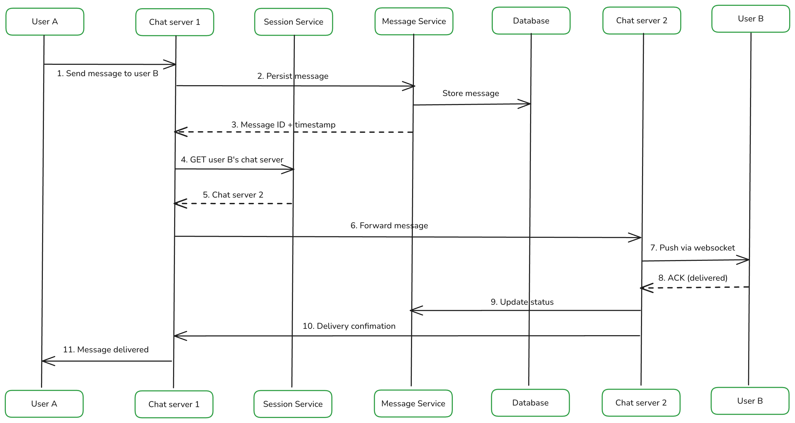

## 1. Clarify Requirements

### 1.1 Functional Requirements

- One-to-one and group messaging (up to 500 members)
- Message delivery receipts: sent -> delivered -> read
- Online/offline presence + last seen
- Typing indicators (ephemeral, never stored)
- Push notifications for offline users
- Message history with multi-device sync
- Media sharing: images, videos, voice notes, documents
- End-to-end encryption

### 1.2 Non-Functional Requirements

| Property     | Target                                             |
|--------------|----------------------------------------------------|
| Latency      | < 100 ms delivery when both users online           |
| Availability | 99.99%                                             |
| Consistency  | Eventual for presence/status; durable for messages |
| Delivery     | At-least-once + idempotency (no duplicates shown)  |
| Durability   | No message loss                                    |

**Out of scope:** Audio/video calls, stories, payments, channels.

## 2. Capacity Estimation

| Metric             | Value                         |
|--------------------|-------------------------------|
| DAU                | 500 million                   |
| Messages/user/day  | 50                            |
| Total messages/day | 25 billion                    |
| Avg message size   | 100 bytes (text + metadata)   |
| Media messages     | ~5% of total, avg 500 KB each |
| Concurrent online  | ~10% of DAU = 50 million      |

### 2.1 Throughput

```
Writes  = 500M * 50 / 86,400 ≈ 290K msg/sec
Peak (3x)                     ≈ 870K msg/sec
```

### 2.2 Storage

```
Text/day  = 290K * 100B * 86,400 ≈ 2.5 TB/day  (~900 TB/year)
Media/day = 290K * 0.05 * 500KB * 86,400 ≈ 625 TB/day  (S3, not DB)
```

### 2.3 Bandwidth

```
Inbound  = 870K * 100B ≈ 87 MB/sec
Outbound ≈ 6x inbound  ≈ 580 MB/sec
```

Outbound is 6x because ~30% of messages go to groups (avg 20 members), fanning out 1 write to 20 reads.

### 2.4 WebSocket Connections

```
50M concurrent users, each holding 1 WebSocket
1 Chat Server handles ~50K connections
Minimum ~1,000 Chat Servers; ~2,000 at peak
```

## 3. Core APIs

### 3.1 WebSocket: Real-Time Events

Single persistent connection. The `type` field acts as a route identifier -- all message types, ACKs, typing indicators, and presence updates share the same channel.

**Send message (client -> server)**

```json
{
  "type": "send_message",
  "sender_id": "uuid",
  "receiver_id": "uuid",
  "content": "encrypted_payload",
  "message_type": "text",
  "client_message_id": "uuid-v4"
}
```

`client_message_id` is the idempotency key. On network-drop retries, the server deduplicates on this key and returns the existing ACK without re-persisting.

**Server ACK (server -> client)**

```json
{
  "type": "message_ack",
  "client_message_id": "uuid-v4",
  "server_message_id": "TimeUUID",
  "status": "sent",
  "server_timestamp": "2024-01-15T10:30:00.123Z"
}
```

`server_message_id` (TimeUUID) is used for ordering and cursor pagination. `server_timestamp` is the authoritative clock, preventing skew between devices.

**Typing indicator (client -> server)**

```json
{ "type": "typing", "conversation_id": "uuid", "user_id": "uuid" }
```

Ephemeral -- never persisted, never queued for offline users. UI auto-clears after 5s.

### 3.2 REST: Stateless Operations

| Method | Endpoint                                                  | Purpose                      |
|--------|-----------------------------------------------------------|------------------------------|
| `GET`  | `/conversations/{id}/messages?cursor=<TimeUUID>&limit=20` | Paginated message history    |
| `PUT`  | `/messages/{id}/status`                                   | Update `delivered` / `read`  |
| `GET`  | `/users/{id}/presence`                                    | Online status + last seen    |
| `POST` | `/media/upload-url`                                       | Get pre-signed S3 upload URL |

**Pagination:** Cursor maps directly to Cassandra's clustering key for O(log n) seek. Offset pagination requires counting N rows -- O(n) and unusable at 25B messages.

**Status transitions** are monotonic (sent -> delivered -> read). Backward transitions are rejected. For group messages, status is tracked per-recipient in a separate table.

**Media upload:** Client sends file type and size, receives a pre-signed S3 URL (expires in 5 min). Client uploads directly to S3 -- app servers never handle media bytes.

## 4. High-Level Architecture

### 4.1 Components

```
┌─────────────────────────────────────────────────────────────────────┐
│                              CLIENTS                                  │
│          [User A / Phone]    [User B / Phone]    [User B / Tablet]   │
└──────────────┬────────────────────┬──────────────────────┬───────────┘
               │  WebSocket          │  WebSocket           │
┌──────────────▼────────────────────▼──────────────────────▼───────────┐
│                    L4 TCP Load Balancer                                │
│              Consistent hashing by user_id  (sticky routing)          │
└──────────────┬────────────────────┬──────────────────────┬───────────┘
               │                    │                       │
    ┌──────────▼──────┐    ┌────────▼────────┐    ┌────────▼────────┐
    │  Chat Server A  │◄──►│  Chat Server B  │◄──►│  Chat Server C  │
    │   (stateful)    │gRPC│   (stateful)    │gRPC│   (stateful)    │
    └──────┬──────────┘    └──────┬──────────┘    └──────┬──────────┘
           └───────────────────────┼──────────────────────┘
                                   │
       ┌────────────┬──────────────┼────────────┬──────────────┐
       │            │              │            │              │
┌──────▼──────┐ ┌───▼──────┐ ┌────▼────────┐ ┌─▼──────────┐ ┌▼─────────────┐
│   Session   │ │ Message  │ │    Group    │ │    User    │ │Notification  │
│   Service   │ │ Service  │ │   Service   │ │   Service  │ │  Service     │
│  (Redis)    │ │          │ │(PostgreSQL) │ │(PostgreSQL)│ │(APNs / FCM)  │
└─────────────┘ └────┬─────┘ └─────────────┘ └────────────┘ └──────────────┘
                     │
          ┌──────────┼──────────────┐
          │          │              │
   ┌──────▼──┐ ┌─────▼──────┐ ┌────▼──────────┐
   │Cassandra│ │   Kafka    │ │  S3 + CDN     │
   │(messages│ │(msg queue  │ │ (media files) │
   │  DB)    │ │ + fanout)  │ └───────────────┘
   └─────────┘ └────────────┘
```

### 4.2 Core Services

**Chat Server (stateful)** -- Maintains persistent WebSocket connections. Each user is pinned to one Chat Server via consistent hashing. Responsibilities:
- Hold WebSocket connections and track heartbeats
- Persist messages via Message Service before any delivery attempt
- Look up recipient's Chat Server via Session Service, forward via gRPC
- Drain the user's Kafka offline queue on reconnect

**Session Service (Redis)** -- Routing table for the system. Each device gets a key: `session:{user_id}:{device_id}` -> Chat Server ID (60s TTL, refreshed by heartbeat). A separate `devices:{user_id}` set holds all active device IDs. To route a message, look up all device IDs, resolve each to a Chat Server, and issue gRPC calls. Missed heartbeats let keys expire naturally.

**Message Service (Cassandra)** -- Owns persistence and delivery status. Every message is written here before any routing attempt (persist-before-deliver). Generates `server_message_id` (TimeUUID) and authoritative `server_timestamp`. Tracks per-recipient delivery status.

**Group Service (PostgreSQL)** -- Stores group metadata and membership with roles. Provides member lists for fanout. Enforces the 500-member cap and admin-only operations.

**Notification Service (APNs / FCM)** -- Alerts offline users via OS push. Does not carry message content, only wakes the app. Respects muted conversations and DND. Retries with exponential backoff on transient failures.

**Kafka** -- Two topics:
- `offline-messages` -- partitioned by `hash(user_id)`. One message enqueued per offline device. Ordering per user preserved within partition. 24-48h retention (delivery buffer, not source of truth).
- `group-fanout` -- partitioned by `group_id`. Consumed by a worker pool for large group delivery.

**Media Service (S3 + CDN)** -- Clients upload directly to S3 via pre-signed URL. CDN serves cached content from the nearest edge. Lambda generates thumbnails post-upload.

### 4.3 Key Decisions

**Why Chat Servers are stateful:** A WebSocket is a long-lived connection pinned to one server. All messages for a user must route through their current Chat Server. This requires consistent-hash routing by `user_id`, not round-robin. Cross-server delivery uses Session Service lookup + gRPC.

**Sync vs async delivery:**
- **Online** (synchronous): persist -> ACK -> Session Service lookup -> gRPC to recipient -> deliver (~100 ms)
- **Offline** (asynchronous): persist -> ACK -> Kafka queue -> push notification. Delivered from Kafka on reconnect.
- **Large group fanout** (asynchronous): single Kafka event consumed by a worker pool, preventing one Chat Server from blocking on hundreds of gRPC calls.

## 5. Database Design

### 5.1 Database Choice

| Data               | Database   | Reason                                                      |
|--------------------|------------|-------------------------------------------------------------|
| Messages           | Cassandra  | 290K writes/sec, time-series ordering, no JOINs, masterless |
| Users, Groups      | PostgreSQL | Relational, ACID, foreign key constraints                   |
| Sessions, Presence | Redis      | Sub-ms key-value, built-in TTL, ephemeral                   |
| Media              | S3 + CDN   | Binary blobs, 11-nines durability, edge delivery            |

### 5.2 Database Schema

#### Messages Table (Cassandra)

| Column            | Type      | Key                   | Description                                                |
|-------------------|-----------|-----------------------|------------------------------------------------------------|
| `conversation_id` | UUID      | Partition Key         | Groups all messages for one conversation on the same node  |
| `message_id`      | TIMEUUID  | Clustering Key (DESC) | Time-ordered; enables sequential reads from partition tail |
| `sender_id`       | UUID      | --                    | Message author                                             |
| `content`         | TEXT      | --                    | Encrypted payload                                          |
| `message_type`    | TEXT      | --                    | `text`, `image`, `video`, `voice`, `doc`                   |
| `media_url`       | TEXT      | --                    | S3/CDN URL for media messages                              |
| `created_at`      | TIMESTAMP | --                    | Server-authoritative creation time                         |

`conversation_id` as partition key keeps all messages for a conversation on the same node (no scatter-gather). `message_id` as TIMEUUID clustering key stores messages sorted by time on disk -- fetching the last 20 messages is a sequential read, no sort step.

#### Message Delivery Status Table (Cassandra)

| Column         | Type      | Key            | Description                    |
|----------------|-----------|----------------|--------------------------------|
| `message_id`   | TIMEUUID  | Partition Key  | Links to the message           |
| `recipient_id` | UUID      | Clustering Key | Target user                    |
| `device_id`    | TEXT      | Clustering Key | One row per device per message |
| `status`       | TEXT      | --             | `sent`, `delivered`, `read`    |
| `updated_at`   | TIMESTAMP | --             | Last status change             |

Separate table for per-device tracking. A message to User B with 3 devices creates 3 rows. `delivered` fires when any device ACKs. A 50-member group message with 3 devices each creates 150 rows here, keeping the messages table clean.

#### User Conversations Table (Cassandra)

| Column                 | Type      | Key                   | Description                          |
|------------------------|-----------|-----------------------|--------------------------------------|
| `user_id`              | UUID      | Partition Key         | Inbox owner                          |
| `last_message_at`      | TIMESTAMP | Clustering Key (DESC) | Sorts conversations by recency       |
| `conversation_id`      | UUID      | --                    | Links to the conversation            |
| `last_message_preview` | TEXT      | --                    | Truncated last message for list view |
| `unread_count`         | INT       | --                    | Unread message count                 |

Denormalized inbox index. Without it, loading the conversation list would require scanning every conversation's last message. Trade-off: one group message updates N rows (write amplification), but inbox loads are instant.

#### Users Table (PostgreSQL)

| Column            | Type         | Constraints                   | Description                    |
|-------------------|--------------|-------------------------------|--------------------------------|
| `user_id`         | UUID         | PK, DEFAULT gen_random_uuid() | Unique user identifier         |
| `phone_number`    | VARCHAR(20)  | UNIQUE, NOT NULL, INDEXED     | Phone number for auth          |
| `display_name`    | VARCHAR(100) | NULLABLE                      | User display name              |
| `profile_pic_url` | TEXT         | NULLABLE                      | S3/CDN URL for profile picture |
| `created_at`      | TIMESTAMP    | DEFAULT NOW()                 | Account creation time          |

#### Groups Table (PostgreSQL)

| Column       | Type         | Constraints                   | Description             |
|--------------|--------------|-------------------------------|-------------------------|
| `group_id`   | UUID         | PK, DEFAULT gen_random_uuid() | Unique group identifier |
| `group_name` | VARCHAR(100) | NOT NULL                      | Group display name      |
| `created_by` | UUID         | FK -> users                   | Group creator           |
| `created_at` | TIMESTAMP    | DEFAULT NOW()                 | Group creation time     |

#### Group Members Table (PostgreSQL)

| Column      | Type        | Constraints                                    | Description          |
|-------------|-------------|------------------------------------------------|----------------------|
| `group_id`  | UUID        | PK (composite), FK -> groups (CASCADE)         | Parent group         |
| `user_id`   | UUID        | PK (composite), FK -> users (CASCADE), INDEXED | Member               |
| `role`      | VARCHAR(10) | DEFAULT 'member'                               | `admin` or `member`  |
| `joined_at` | TIMESTAMP   | DEFAULT NOW()                                  | When the user joined |

## 6. Deep Dive

### 6.1 Message Flows

#### One-to-one (both online)



1. User A sends a message over WebSocket to Chat Server A
2. Chat Server A persists to Cassandra via Message Service, receives `server_message_id` + `server_timestamp`
3. Chat Server A sends `sent` ACK back to User A -- message is durable before any delivery attempt
4. Chat Server A queries Session Service for User B's Chat Server
5. Chat Server A forwards the message to Chat Server B via gRPC
6. Chat Server B pushes the message to User B over WebSocket
7. User B's ACK propagates back; delivery status updated to `delivered`
8. Chat Server A delivers the `delivered` receipt to User A

End-to-end latency ~100 ms.

#### Offline Delivery

**Phase 1 -- Sender side:**

1. User A sends a message over WebSocket
2. Chat Server A persists to Cassandra, ACKs `sent` to User A
3. Session Service lookup returns User B as NOT ONLINE
4. Chat Server A enqueues to Kafka `offline-messages` (partitioned by `user_id`)
5. Notification Service sends a push via APNs/FCM (wakes the app, no message content)

**Phase 2 -- On reconnect:**

User B connects to a Chat Server. The server queries Cassandra for all `message_delivery_status` rows where `recipient_id = user_b AND status = 'sent'` -- Cassandra is the source of truth. Kafka is also drained as a fast-path for users reconnecting within the 24-48h retention window. Before pushing any Kafka entry, the server checks delivery status first -- if already `delivered` by another device, the message is skipped. A reconciliation job scanning `status = 'sent'` records older than 5 minutes acts as the safety net.

#### Group Fanout

**Direct fanout (up to 100 members):**

1. Chat Server A persists the message once (with `group_id`, not duplicated per member)
2. ACKs `sent` to the sender
3. Fetches member list from Group Service
4. Bulk-resolves all members to their Chat Servers via Session Service
5. Sends one batched gRPC call per Chat Server (not per member)
6. Each Chat Server delivers to its online members; offline members are enqueued to Kafka

**Kafka fanout (100+ members):**

1. Chat Server A publishes a single event to `group-fanout` (partitioned by `group_id`)
2. Worker pool consumes and splits members into subsets
3. Each worker resolves routing via Session Service and delivers in parallel

The 100-member cutoff is a tunable config.

#### Media Upload and Delivery

1. Client requests a pre-signed URL via `POST /media/upload-url`
2. Client uploads AES-256 encrypted file directly to S3
3. Client sends a WebSocket message with `media_id` + AES key (inside E2E encrypted payload)
4. Recipient fetches media from CDN by `media_id`
5. Recipient decrypts with the AES key from the message payload

S3 stores only ciphertext. Even if S3 is compromised, the AES key exists only inside the E2E encrypted message, unreadable by the server.

### 6.2 User Presence, Multi-Device Sync

**Presence: Redis heartbeat + TTL**

- On connect: `SET presence:user_123 "online" EX 30`
- Every 10s: client heartbeat, server runs `EXPIRE presence:user_123 30`
- Graceful disconnect: delete key, write `last_seen` timestamp (TTL 24h)
- Silent drop (crash/network loss): key auto-expires after 30s

No explicit disconnect detection needed. TTL handles all failure modes uniformly.

**Multi-device sync**

When a message arrives, it is pushed to every connected device simultaneously. Each device ACKs independently. `delivered` is set when any device ACKs; `read` is set when the user opens the conversation on any device. Offline devices receive pending messages from Kafka on reconnect. Outgoing messages are also pushed to the sender's other devices via the same `devices:{sender_id}` lookup.

**Load balancing: consistent hash on user_id**

- L4 TCP LB with consistent hash ring keyed on `user_id`
- Same user always routes to the same Chat Server, stable across IP changes (WiFi -> cellular)
- Adding a server remaps only ~1/N of users
- Removing a server: affected users reconnect with exponential backoff, Session Service entry overwrites
- Auto-scale trigger: CPU > 70% or connections > 40K per server
- Scale-in: send reconnect signal to drain gracefully before shutdown

### 6.3 Reliability and Failure Handling

**Delivery guarantees:**
- **At-least-once** -- sender retries until it receives a `sent` ACK
- **Exactly-once processing** -- `client_message_id` deduplication; retries return the existing ACK without re-persisting
- **Ordering** -- TIMEUUID clustering key keeps messages sorted; Kafka partition ordering for queued messages
- **No loss** -- message is persisted before any routing; reconciliation job catches stragglers

**Failure scenarios:**

| Failure                         | Recovery                                                                                 |
|---------------------------------|------------------------------------------------------------------------------------------|
| Chat Server crash               | Client reconnects with backoff; LB routes to next node in hash ring; Kafka queue drained |
| Cassandra node down             | RF=3 across AZs; quorum writes (W=2) stay durable with 1 replica down                    |
| Kafka partition down            | Message already in Cassandra; reconciliation job requeues stuck `sent` records           |
| Network partition (split brain) | Old session TTL expires (60s); new Chat Server overwrites on reconnect                   |
| Retry duplicate                 | `client_message_id` dedup at the server                                                  |
| Push notification failure       | Retry with backoff; if user reconnects first, Kafka delivers directly                    |

### 6.4  Security

**Authentication:**
- Phone number + OTP via SMS
- On success: short-lived JWT (~15 min) + long-lived refresh token stored on device
- JWT sent in WebSocket upgrade header; Chat Server validates before accepting
- Token refresh is transparent, no WebSocket reconnect needed

**E2E encryption (1:1): Signal Protocol**
- Each device generates a key pair locally; only the public key is uploaded
- Sender fetches recipient's public key and derives a shared session key via Diffie-Hellman
- Per message: sender encrypts with session key; only ciphertext travels through servers
- Double Ratchet algorithm rotates keys per message (forward secrecy -- compromising today's key does not expose past messages)

**Group encryption: Sender Key model**
- Sender generates one symmetric sender key per group
- Distributes it to each member, encrypted with that member's public key
- All group messages encrypted once with this sender key
- On member leave: new sender key generated and distributed; ex-member cannot decrypt future messages

## 7. Wrap Up

**Key decisions:**

| Decision           | Choice                                | Why                                        |
|--------------------|---------------------------------------|--------------------------------------------|
| Real-time protocol | WebSocket                             | Full-duplex push; polling won't scale      |
| Message DB         | Cassandra                             | Write-heavy, time-series, masterless HA    |
| User/Group DB      | PostgreSQL                            | Relational, ACID, foreign keys             |
| Session/Presence   | Redis                                 | Sub-ms lookups, TTL auto-expiry            |
| Queue              | Kafka                                 | Durable, ordered per partition, replayable |
| Media              | S3 + CDN                              | Bypass app servers, edge delivery          |
| Fanout             | Hybrid (direct up to 100, Kafka 100+) | Latency for small groups, scale for large  |
| Encryption         | Signal Protocol                       | Server-blind, forward secrecy              |
| Idempotency        | `client_message_id`                   | Safe retries on network drops              |
| Pagination         | Cursor (TimeUUID)                     | O(log n) vs O(n) offset                    |
| Load balancing     | Consistent hash on `user_id`          | Stable routing across IP changes           |

**Bottlenecks and mitigations:**
- Chat Server connection count: auto-scale on CPU/connections, consistent hash redistributes
- Group fanout spikes: Kafka worker pool absorbs bursts
- Outbound bandwidth (6x inbound): CDN handles media, Kafka workers spread fanout

**Monitoring:** message delivery latency p99, WebSocket connections per server, Kafka consumer lag, Cassandra write error rate, Session Service cache hit rate.
